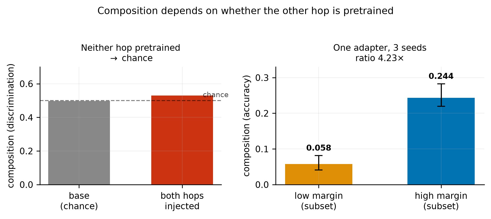
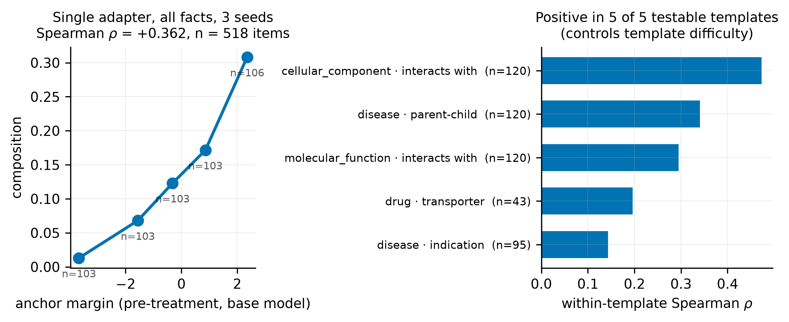
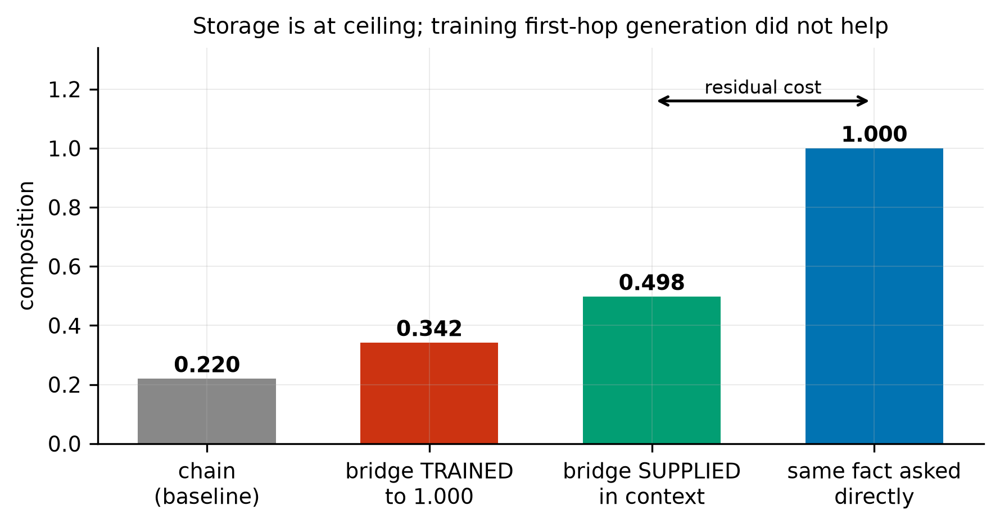
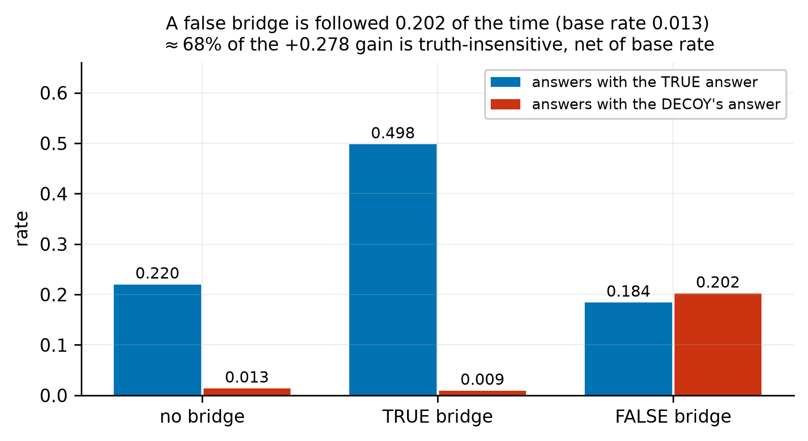
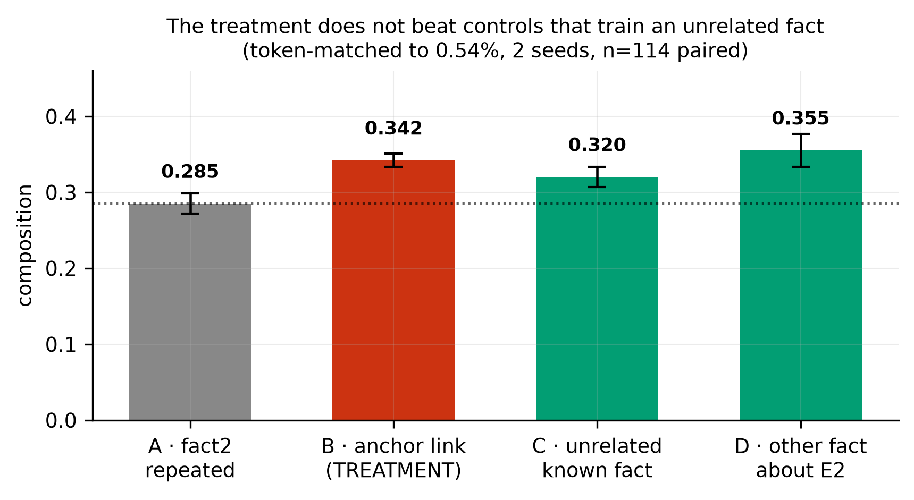
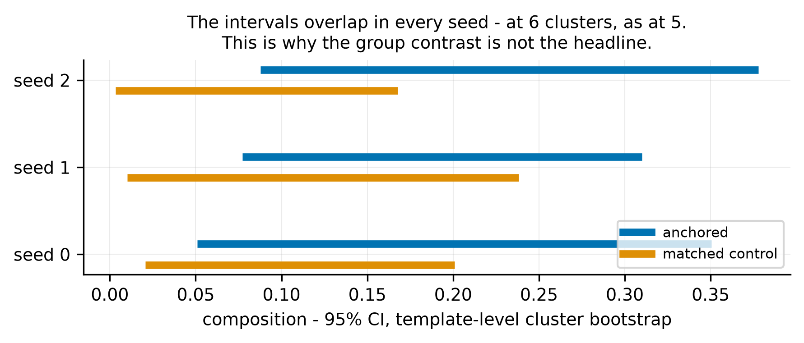
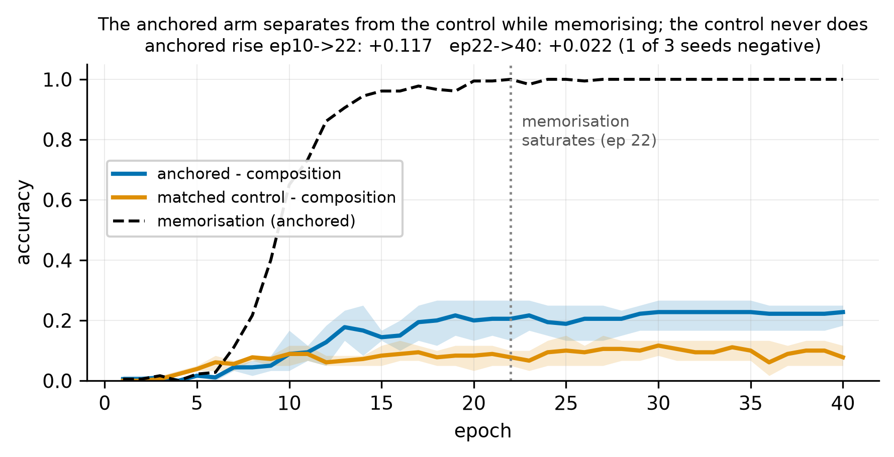
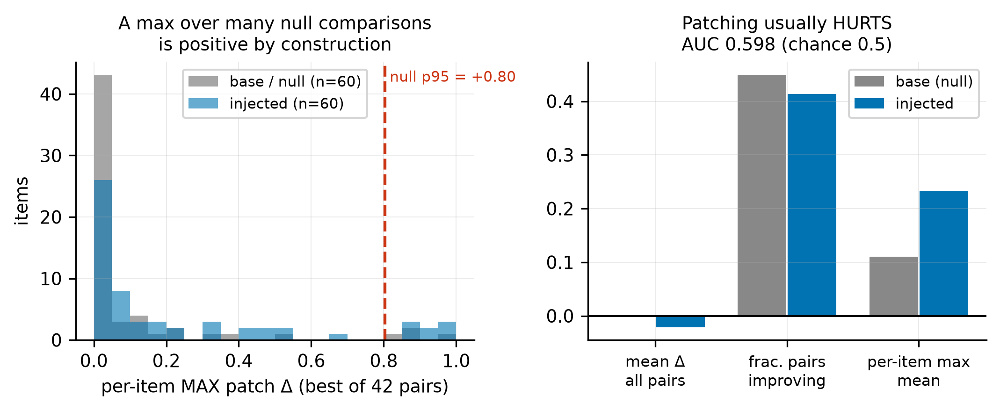

# Stored, Not Integrated: A Pre-Treatment Predictor and Three Controls for Knowledge Injection

**Preprint — Zenodo.** Version 2 (v0.2.0), 2026-08-16.

**Author:** Alex Liu
**License:** CC BY 4.0
**DOI:** [10.5281/zenodo.21865285](https://doi.org/10.5281/zenodo.21865285)
**Keywords:** continual learning · knowledge injection · fine-tuning · multi-hop composition · knowledge editing · evaluation methodology · negative results

**Cite as:** Alex Liu (2026). *Stored, Not Integrated: A Pre-Treatment Predictor and Three Controls for Knowledge Injection.* Zenodo. https://doi.org/10.5281/zenodo.21865285

---

## Abstract

Fine-tuning stores new facts almost perfectly and leaves them unusable: in our setting injected-fact recall is 1.000 while two-hop composition using the same fact is 0.22. Recent work shows in controlled synthetic pretraining that composition requires prior compositional exposure. We ask a narrower question on a real pretrained model: **can we predict, before fine-tuning, which injected facts will become usable?** We can. A per-item measurement taken on the base model — how well it discriminates the other hop of the chain — is associated with post-injection composition (Spearman ρ = +0.362 over 518 items injected in a single adapter, three seeds averaged; template-bootstrap CI [+0.204, +0.435]; template-stratified permutation p = 0.0001). The association is attenuated but not removed by controlling for how well the model already knows the bridge entity itself (+0.362 → +0.219), so it is not a restatement of that entity's familiarity.

We then decompose the failure and find that two of its four candidate causes are not where the problem is. Storage is not the constraint: recall of the injected fact is 1.000 in its training form and 0.71–0.81 when rephrased. **Training explicit first-hop generation did not improve chaining**: raising bridge-entity generation from 0.000 to 1.000 yields no gain over a control that trains an unrelated fact. Supplying the bridge in context does help (0.220 → 0.498), but a false-bridge control shows **a quantity equal to ≈68% of that gain is followed regardless of whether the bridge is correct**. A residual compositional cost survives all three interventions.

Two interventions returned negative results: training the anchor link did not outperform a control that trains an unrelated fact, and the group contrast did not generalise across templates. We also re-examine a published self-patching oracle diagnostic, which selects the best layer pair per instance against a baseline of zero; applying the same per-instance selection to an uninjected model yields a per-item maximum of +0.80.

---

## 1 · Introduction

Deployed language models do not accumulate knowledge. The obvious diagnosis is that they cannot store new facts, and it is wrong. Fine-tuning stores facts well; what fails is *use*. On our data, a model asked plainly for an injected fact answers correctly 1.000 of the time, and the same model asked to use that fact as one step of a two-hop question answers correctly 0.22 of the time. When neither hop is pretrained, composition sits at chance and stays there through 34 epochs past memorisation saturation.

This gap is measured independently in at least three literatures that mostly do not cite one another (§2). What has been less clear is **what determines which side of the gap a given fact lands on** — and whether that can be known in advance.

**Our question is deliberately narrow.** Recent work establishes, in controlled synthetic pretraining, that composition requires prior compositional exposure: individuals seen in compositional contexts reach 0.83 two-hop accuracy while those absent stay at 0.01, with single-hop accuracy 0.97 for both [Karmim et al., 2026]. We do not claim that phenomenon. We ask whether, on a real pretrained model where exposure cannot be manipulated, the dependence is **graded** and **measurable in advance**.

### Contributions

1. **A pre-treatment, per-item predictor** of whether an injected fact will compose, computed on the base model before any training from five teacher-forced continuation scores — the correct bridge and four same-template distractors (§5.1). It is graded, not binary, and it is attenuated but not removed by controlling for bridge-entity familiarity (§5.2).
2. **A four-way decomposition** of the failure — storage, explicit first-hop generation, in-context availability, residual — locating where interventions on the first three leave the gap unchanged (§5.3).
3. **Three controls**, each of which changes the size of an effect obtained without it: a false-intermediate control for "supply the bridge" designs (§5.4), a null-controlled comparison for self-patching (§6), and a data-diversity control for knowledge-augmentation designs (§5.5).
4. **Two negative results** (§5.5, §5.6): an intervention derived from the diagnosis did not beat its control, and the template-generalisation test did not reach significance after the design change intended to secure it.

**Relation to prior work.** Each of the phenomena involved has prior art (§2): models following supplied-but-wrong intermediates, intermediates being no more retrievable in composing models, and composition depending on prior exposure. What is added here is the per-item pre-treatment predictor, and controls that quantify how much of two standard arguments survives.

---

## 2 · Related work

**Four literatures, one phenomenon.** Knowledge-editing reports ripple-effect failures where edits do not propagate to logically entailed consequences [Cohen et al., 2024]. Latent multi-hop reasoning reports chance-level composition of finetuned facts [Yang et al., 2025]. Continual knowledge injection reports knowing-using gaps of 81–92 percentage points — memorisation 99.8% against generalisation 7.8–18.2% [Dai et al., 2026]. Agent memory builds systems whose central failure mode is that stored knowledge goes unused, and is **disconnected from all three in both directions** — verified by a two-directional bibliography check.

*(Checked in both directions: three of the four literatures do cross-cite; agent memory is the disconnected one.)*

**Prior exposure bounds composition.** [Karmim et al., 2026] manipulate compositional exposure during synthetic pretraining and find composition transfers only to entities seen in compositional contexts (0.83 vs 0.01). Their predictor is binary and manipulated during pretraining; the one used here is continuous and measured on a model we did not train.

**The intermediate is not more retrievable in composing models.** [Johnston & Belrose, 2025] probe for the bridge entity and find it "not more retrievable in models where we infer two-function composition than in models where we infer memorization", and "barely more retrievable than an arbitrary relation of the first entity". Our §5.3 reaches the same conclusion by intervention rather than probing: we *train* bridge generation to 1.000 and observe no compositional gain. Their paper notes that probes failed to detect differences which other measures did detect.

**Models follow supplied-but-wrong intermediates.** Well documented across unfaithful chain-of-thought [Turpin et al., 2023], adversarial multi-hop QA [Wu et al., 2024; Serbanescu et al., 2025], and context-vs-parametric knowledge conflict [Longpre et al., 2021]. We do not claim this as a finding. We use it as a **control**, and quantify what fraction of a claimed composition benefit it accounts for (§5.4).

**Multi-hop knowledge editing.** [Zhang et al., 2025] show multi-hop factual recall draws on deeper MLP layers than single-hop recall, and edit shallow and deep layers accordingly. [Yang et al., 2026] trace multi-hop recall to query–value neuron pathways activated by implicit subjects, and edit those pathways. Both target the failure measured here, from the intervention side rather than the measurement side.

**Shortcut detection in multi-hop settings** uses entity co-occurrence filtering and ablated prompts [Yang et al., 2025], or knowledge-neuron analysis with co-occurrence frequency [Ju et al., 2024]. These target E1→E3 direct association. The shortcut we control for is different: routing on a bridge token *supplied in the prompt*, regardless of its truth.

---

## 3 · Task construction

Chaining tasks are built by **graph traversal over PrimeKG/STaRK-Prime** (129,375 nodes, 8,100,498 edges, 10 node types, 18 edge types) rather than by LLM generation. A two-hop chain is a graph query, and generating one is a retrieval problem, not a creative one.

A task is a triple E1 —r1→ E2 —r2→ E3. We inject `fact2` (E2 —r2→ E3) and ask a chaining question whose answer is E3 and whose only route runs through E2. Constraints, all enforced at construction:

- **Pure addition** — no existing edge of the injected relation between E2 and E3
- **No shortcut** — no E1→E3 edge of any type
- **Unique bridge** — exactly one E2 satisfies the first hop
- **Name quality** — 4–40 characters, ≤10 tokens, no IUPAC strings

**Edge direction is type-directed, not stored-direction.** PrimeKG's stored edge orientation does not reliably match a template's semantic direction, and the mismatch differs per relation (`expression present` is stored gene→anatomy while the template needs anatomy→gene; `indication` is stored both ways). Using stored direction would have produced semantically reversed questions for a subset of relations, silently.

**Anchor recoverability is verified per item, on the base model, before injection.** For each item we score the first-hop question against four same-template distractors and record `anchor_margin` = logprob(correct) − max(logprob(distractor)). Items where the base model ranks the correct bridge above every distractor form the **anchored** arm; the rejected items form the **matched control**, built from rejections rather than by separate sampling so that the two groups are matched on template, entity type and one-fact injection at the point of item selection. The split is observational, not assigned: the groups differ in whether hop 1 is recoverable, and may also differ in entity identity and in other item properties we did not measure. Matching constrains those differences; it does not eliminate them.

**It does not match them on training environment.** The arms were trained as separate adapters containing 223 and 295 facts, so any comparison that pools them confounds anchor strength with both the adapter and the fact count. The direct fix is to put both margin signs in one adapter, and §5.1 reports that single-adapter replication as its primary analysis. The separate-adapter dataset is retained for the experiments in §5.3–§5.6, each of which is a within-condition comparison that does not pool across the two groups.

**Injection.** LoRA (r=16, α=32, dropout 0.05) on all seven projection modules; AdamW, lr 2e-4, weight decay 0.01, batch 1 with gradient accumulation 8, 40 epochs, fp16. Qwen2.5-1.5B-Instruct unless stated. Only `fact2` is trained; the anchor is never trained (except in §5.5, where training it is the manipulation).

---

## 4 · Measurement

In this setting **the choice of measure decides the answer**.

**Two matchers, always both.** The source paper's [Dai et al., 2026] `substring_match` accepts `pred in gold`, so a prediction of `"a"` scores correct against gold `"Fazadinium bromide"`. We report both their matcher and a directional one (gold must appear in the prediction, with a length floor) and never rely on theirs alone.

**Accuracy floors, and log-probability is confounded.** Composition accuracy in the unanchored condition is 0.0111 — too close to zero for a predicted decrease to register. Raw log-probability has range, but it is confounded by *format learning*: it moves +0.88 nats over a single epoch while memorisation accuracy is still 0.003. A measure that moves before anything has been learned is measuring the answer template, not the answer.

**The distractor control resolves it.** Scoring the correct answer against same-type distractors under the same prompt absorbs the format gain, because format learning helps all candidates equally. On the base model, composition discrimination is **0.4972** — exactly chance, as it must be.

**Positive control.**

 On trained checkpoints, memorisation discrimination is **1.0000**. A low composition number is therefore a fact about the model, not a broken metric.

> **Figure 8** shows the same checkpoints supporting three different results — 0.0111 accuracy, +0.88 nats log-probability, chance-level controlled discrimination — depending only on the measure. Every other number in this paper is reported with its control for this reason.

**Matched recall.** Every integration comparison is taken at a checkpoint where single-fact recall is equal across conditions; otherwise the comparison measures how much was learned rather than how well it integrated. For the arm experiment (§5.5) the matched point is end-of-training, where compute is identical by construction and recall spread across arms is 0.0000; using the "all facts memorised" checkpoint there would have given the treatment arms *more* training.

**Clustering.** Items share entities, templates and a model, so item-level intervals are anti-conservative. Group comparisons are additionally reported with a template-level cluster bootstrap, and §5.6 reports its effect on the group contrast.

---

## 5 · Results

### 5.1 Composition is graded in a pre-treatment measurement

The unit of analysis is the **item**: each contributes one outcome, averaged over three seeds, against one pre-treatment margin. Intervals are percentile bootstrap resampling **templates**, since items within a template share entities and phrasing.

**Design.** All 518 facts — spanning the full margin range, both signs — are injected in a **single adapter**, so the predictor's value cannot identify which model produced the answer. This matters because the alternative is to train the two margin groups as separate adapters and pool them, and in that design a margin/outcome association can be produced entirely by a difference between the two models. Both designs were run, and both are reported below.

**Which design each result uses.** The dose-response (§5.1) and the entity-familiarity control (§5.2) are computed on the single adapter. The decomposition and the remaining experiments (§5.3–§5.6) were run on the separate-adapter dataset and are reported there; each is a within-condition comparison that does not rest on pooling across the two margin groups, so the confound above does not apply to them. Composition is lower in the single adapter — 0.244 against 0.220 for the high-margin group, but 0.058 against 0.087 for the low-margin one — because it holds 518 facts rather than 223 or 295 (§5.7). Absolute values are therefore not comparable across the two designs.

| design | scope | n items | ρ | 95% CI (template bootstrap) |
|---|---|---:|---:|---|
| **single adapter** | **all items** | **518** | **+0.362** | **[+0.204, +0.435]** |
| single adapter | high-margin subset | 223 | +0.235 | [+0.090, +0.437] |
| single adapter | low-margin subset | 295 | +0.229 | [+0.088, +0.325] |
| separate adapters | high-margin arm | 223 | +0.213 | [+0.082, +0.426] |
| separate adapters | low-margin arm | 295 | +0.105 | [−0.058, +0.207] |

`anchor_margin` is measured on the base model *before* injection, so it cannot have been influenced by the treatment.

**The confound was not generating the effect.** Removing it *raises* the estimate, from +0.271 in the confounded pooling to +0.362 in the single adapter. The clearest evidence is the two subsets: within one adapter the margin predicts about equally well among high-margin and low-margin items (+0.235 and +0.229), whereas in the separate-adapter design the low-margin arm's interval included zero — which is what a between-model artefact would produce.

**Storage cannot be mediating it.** In the single adapter, recall of the injected fact is exactly 1.000 for all 518 items in every seed. The predictor is not selecting facts that were learned better.

**No single template carries it.** Dropping each of the six templates in turn leaves the correlation within [+0.320, +0.395] against +0.362 on the full sample. Within template the association is positive in 5 of 5 testable templates, mean ρ = +0.290, with one template excluded for having n = 20 and no variance.

**A template-stratified permutation test** replaces the normal approximation. Shuffling margins *within* template preserves template composition and breaks only the item-level link, so the null retains whatever between-template signal exists — it is centred at ρ = +0.090, not zero. The observed +0.362 exceeds every one of 10,000 shuffles, two-sided p = 0.0001. Six templates cannot support inference about a template *population*; this tests the item-level association with template structure held fixed.

**The group contrast, in the same single adapter:** high-margin items compose at 0.244 against 0.058 for low-margin items, a ratio of **4.23×** (per seed 5.62×, 4.32×, 3.47×; higher in 3 of 3). The separate-adapter design gave 2.53×, so this contrast was also understated rather than manufactured by the confound. The two designs are not like-for-like: the single adapter holds 518 facts against 223 and 295, a harder training environment in which composition is lower overall (§5.7).

**The template that reversed does not reverse here.** In the confounded pooling `disease · indication` gave ρ = −0.107. In the single adapter it is +0.144, the weakest of the five but positive. We treat the earlier reversal as a property of that design rather than of the relation.

### 5.2 The dependence survives an entity-familiarity proxy

`anchor_margin` confounds *knowing the link* E1→E2 with *knowing the entity* E2. We measured the second directly on the base model, with E1 absent from the prompt entirely. Reported on the same single adapter and the same 518 items as §5.1, seed-averaged.

| predictor of composition | ρ | 95% CI (template bootstrap) |
|---|---:|---|
| anchor margin | **+0.362** | [+0.204, +0.435] |
| entity familiarity | +0.080 | — |
| margin, **controlling entity familiarity** | **+0.219** | **[+0.044, +0.410]** |
| familiarity, **controlling margin** | −0.164 | — |

Inference here uses the same standard as §5.1, not the item-level normal approximation: the interval is a template bootstrap and the p-value comes from a template-stratified permutation test, which puts the controlled association outside all 10,000 shuffles (p = 0.0001). The interval is wide and its lower bound is close to zero.

Controlling for familiarity **attenuates the margin effect but does not remove it**, from +0.362 to +0.219. Within template the controlled association is +0.246, positive in five of five testable templates. This rules out one specific alternative — that the margin is a proxy for how well the model already knows the bridge entity — using one operationalisation of familiarity. It does not establish that the dependence is relational in general; other properties correlated with the margin remain untested, and the attenuation shows the two are not independent.

Familiarity's raw and controlled associations have opposite signs (+0.080 and −0.164). We report this without an account of it.

Entity familiarity has a small *negative* independent effect (−0.164 across all items, −0.201 within-template). We tested the obvious account — a well-known bridge has more competing associations — using PrimeKG degree as a model-independent proxy. Across all items it looked convergent (ρ = −0.252, p = 9.9 × 10⁻⁹ controlling margin, and near-zero correlation with familiarity, so apparently independent evidence). **It largely collapses within template** (mean −0.047, negative in four of five): most of the effect was a bridge-type contrast, since degree differs systematically between drugs, genes and diseases. We report the negative effect as an observation with no supported mechanism.

### 5.3 Training explicit first-hop generation did not improve chaining

| failure mode | intervention | result |
|---|---|---|
| storage, trained form | ask for the injected fact **in its training string** | **1.000** |
| storage, form-robust | ask for the same fact **rephrased** | **0.71–0.81** |
| explicit first-hop generation | **train** bridge generation | 0.000 → **1.000**; no gain over control |
| in-context availability | **supply** the bridge as tokens | 0.220 → **0.498** (but see §5.4) |
| residual | bridge supplied *and* lookup available | 0.498 vs 1.000 for the same fact asked directly |

The second row is the substantive result. In every baseline run the model **cannot generate the anchor** (`fact1` accuracy 0.0000) while discriminating it above distractors — the discriminative/generative gap of §5.7, appearing inside the anchor itself. Training it to 1.000 is a real manipulation of *explicit first-hop generation*, and it produced no anchor-specific benefit (§5.5). Whether the bridge is retrievable by some route the model does not surface as output is not measured here.

> **The dissociation:** the model can be made to produce the bridge perfectly and compose no better; but having the bridge present as tokens roughly doubles composition. What these two conditions differ in is whether the intermediate is present in the context, so that is what the comparison isolates. It does not follow that the model cannot obtain the bridge internally — only that being trained to emit it did not help.

This agrees with [Johnston & Belrose, 2025]'s probing result and strengthens it: a probing null is weak evidence, a manipulation driven to ceiling is not.

### 5.4 A false-intermediate control: ≈68% of the "supply the bridge" gain is truth-insensitive

Supplying the intermediate is a standard way to argue that composition is bottlenecked on retrieval. We test what that argument is worth by supplying a **false** bridge — drawn from another item of the same template, whose own `fact2` was also injected, so the model has a stored answer for it.

| condition | → true answer | → false answer |
|---|---:|---:|
| chain | 0.2197 | 0.0135 |
| chain + **true** bridge | **0.4978** | 0.0090 |
| chain + **false** bridge | 0.1839 | **0.2018** |
| direct question about the false bridge | 0.0000 | **1.0000** |

The false bridge is followed 0.2018 of the time against a base rate of 0.0135 — a **15×** increase. Net of that base rate the induced following is 0.1883, against a true-bridge gain of 0.2781: **a ratio of ≈68%.**

The ratio is descriptive. It compares two quantities measured in separate conditions and assumes the two routes combine additively, which is not established here.

**Two routes, competing.** Not everything is lookup: the model declines the false bridge 80% of the time; under a true bridge its wrong-answer rate is 0.0090; and under a false bridge it still produces the *true* answer 0.1839 of the time against 0.2197 unaided — a contradicting bridge costs only −0.036. Truth-insensitive lookup (≈0.20) and the model's own path (≈0.18–0.22) agree and reinforce under a true bridge, and split under a false one.

> **What follows.** A `chain + intermediate` score is a mixture of composition and truth-insensitive lookup. Reported without this control it overstates composition substantially in this setup. The phenomenon is documented [Turpin et al., 2023; Wu et al., 2024; Serbanescu et al., 2025]; the fraction is specific to this setting.

### 5.5 Training the anchor link does not outperform matched controls

Our diagnosis suggested an intervention: during injection, also train the anchor link, converting the bridge from discriminatively known to generatively available. Four arms, each with **two training items per fact** so that token count, example count and schedule are matched (token spread across arms: 0.54%), differing only in the identity of the second item. Two seeds, 114 paired items.

| arm | second training item | composition |
|---|---|---:|
| A | `fact2` repeated | 0.2851 |
| **B** | the anchor link (treatment) | **0.3421** |
| C | a known fact about an **unrelated** entity | 0.3202 |
| D | a different known fact about **E2** | 0.3553 |

Predictions were fixed before any arm was run (they are reproduced in `src/analyze_arms.py`; there is no timestamped public pre-registration). Outcomes: B > A — **not significant**. Per seed: +0.079 (McNemar 16/7, p = 0.093) and +0.035 (10/6, p = 0.455). B > D — **refuted**, D is highest. B > C with C ≈ A — **refuted**, an unrelated fact helps as much. Gain largest for weak anchors — **reversed**, and the reversal appears in *every* arm, so it is not anchor-specific.

The manipulation itself was clean: anchor generation 0.000 → 1.000, recall spread across arms 0.0000, all arms learned their extra fact.

> **No detectable anchor-specific benefit.** B does not separate from C or D in either seed, so the result is consistent with a generic second-example effect rather than anything about the anchor: the spread among B, C and D (0.035) is no larger than seed noise (0.018–0.044). B − A is itself non-significant in both seeds (p = 0.093, p = 0.455), so this is a failure to detect, and we do not claim a diversity effect has been established either.

**Scope.** At n = 114 the paired design detects ≈+0.07. An anchor-specific effect smaller than that is not excluded. The claim is *no detectable anchor-specific benefit*, not *no benefit*.

**Why arm A is the weaker baseline.** It repeats one example, so A vs {B, C, D} confounds the identity of the second fact with training-data diversity. The anchor-specific question is answered by B vs C vs D, and those are indistinguishable.

### 5.6 The group contrast does not generalise across templates

Our matched-control contrast has non-overlapping seed ranges, but items cluster by template and a template-level bootstrap is the appropriate test. At five templates the confidence intervals overlapped. We rebuilt the dataset with seven templates specifically to fix this.

| | anchored | control | overlap |
|---|---|---|---|
| seed 0 | [0.0510, 0.3506] | [0.0206, 0.2008] | yes |
| seed 1 | [0.0773, 0.3100] | [0.0103, 0.2383] | yes |
| seed 2 | [0.0877, 0.3779] | [0.0034, 0.1678] | yes |
| pooled | [0.0724, 0.3481] | [0.0138, 0.2002] | yes |

**The fix did not work.** The design yields six usable clusters rather than seven, and going from five to six did not close the overlap. The effect size also fell — 3.69× at five templates to 2.53× at seven — indicating the earlier figure benefited from template selection.

We therefore do not claim the group contrast generalises across templates. The dose-response of §5.1 is measured *within* template and is unaffected by this.

### 5.7 Supporting results

**Discrimination far exceeds generation.** Base models answer relation questions at 0.83 discrimination and 0.03 generation across 16 relations × 60 items — a knowing-using gap one level below the main one, and the reason `anchor_margin` is a discriminative measure.

**The anchored arm separates from the control during memorisation, and the control never separates.** Anchored composition rises +0.117 between epoch 10 and memorisation saturation at epoch 22, while the control moves −0.011 over the same window and is flat thereafter.

The divergence is not timed relative to memorisation saturation. Isolating the interval *after* saturation, the rise is **+0.022 with one of three seeds negative** (−0.017, +0.050, +0.033). The evidence supports the anchored/control divergence itself, not a claim that composition emerges once memorisation completes.

**A second scale, descriptively.** At 0.5B the difference runs in the same direction. This is one seed, the anchored run stops at epoch 15 with no final evaluation or manifest, and injected-fact recall differs between the two conditions by 2.1 points, so it is a same-direction observation rather than a replication. It does not establish that the effect holds at that scale.

**Gradient-magnitude masking cannot isolate.** Measured update-support overlap plateaus at ≈0.33; a 100× change in the masking fraction moves it 0.414 → 0.330. Even the top 0.1% of gradient entries overlap a third of the time. This rules out a natural design for testing isolation-vs-integration trade-offs, and implies that methods enforcing low overlap are working *against* the model's preferred update direction.

## 6 · Re-examining a published self-patching result

Self-patching relocates a representation from one layer to another at entity-anchor positions and asks whether the answer improves. [Dai et al., 2026] report two things: an **oracle diagnostic**, which scans all layer pairs per instance and reports the best-performing pair as an upper bound, and a **fixed heuristic** using two predetermined layer pairs applied uniformly, which recovers 58–75% of the oracle headroom. Our analysis concerns the first of these, not the second. **A maximum over many null comparisons is positive by construction.** We ran the identical sweep on an uninjected and an injected model — 60 items, 42-pair grid, same items, same selection procedure — so the same post-hoc maximum is taken on both sides. The uninjected model controls for *injection-specific* relocation; patching can affect a base model, so this is not a measurement of noise alone, and baseline MRR and headroom differ between conditions.

| | base (null) | injected |
|---|---:|---:|
| mean Δ over all pairs | −0.00005 | −0.02146 |
| fraction of pairs improving | 0.449 | 0.414 |
| per-item **max**, mean | +0.1099 | +0.2335 |
| per-item **max**, p95 | **+0.8038** | +0.9187 |

**Patching typically hurts**: mean Δ is negative in both conditions and fewer than half of all pairs improve anything. And on a model with no injected knowledge to relocate, the same post-hoc procedure still yields a per-item maximum of **+0.80** at the 95th percentile.

**What this does and does not bear on.** The oracle diagnostic selects the best pair *per instance*, which is the procedure our null mirrors; a per-item maximum taken over many comparisons is inflated even when nothing has been relocated, so an oracle upper bound obtained this way overstates what patching recovers. Our maximum is over 42 pairs against their larger grid, and a maximum over more candidates is larger in expectation — a directional argument, not a bound, since the two sweeps use different items, a different model and different activation distributions.

The **fixed-heuristic** result is not subject to this: its layer pairs are predetermined rather than searched per instance, so no post-hoc maximum is taken, and that paper additionally reports random-patching and irrelevant-patching controls showing the targeted intervention outperforms them. The one place our analysis touches it is that 58–75% is expressed as a *fraction of the oracle headroom*, and a denominator obtained by per-instance maximisation is inflated by the same selection effect. That changes how the ratio should be read; it does not challenge the fixed-heuristic effect itself.

**Does anything survive?** 13.3% of injected items exceed the base p95 (chance 5%), and AUC of injected-vs-base per-item maxima is 0.598 (chance 0.5). An injection-specific signal is therefore present, but it is marginal. Measured against zero rather than against the same selection procedure on an uninjected model, a per-instance-maximum statistic looks substantially larger than this.

**A second observation about prior work.** The reported temporal lag between memorisation and composition does not appear when both hops are injected, across 34 post-saturation epochs. It appears only under anchoring — so it is a property of the anchored condition, not of injection.

---

## 7 · Limitations

**One domain.** All results use PrimeKG biomedical relations. The anchor effect could depend on how biomedical knowledge is represented. This was not tested.

**One model family, two scales.** Qwen2.5 at 0.5B and 1.5B. Two points do not establish a trend.

**The group contrast does not generalise across templates** (§5.6). The dose-response of §5.1 does not depend on it.

**The intervention arm is underpowered** for small effects (§5.5): ≈+0.07 detectable at n = 114.

**The patching analysis concerns a selection statistic, not a mechanism.** It bears on how a per-instance-maximum diagnostic should be baselined, and it does not localise the effect reported here. 60 items, one seed, one injected checkpoint, coarse grid; the coarseness is conservative for the null argument and un-conservative for detecting a real effect.

**The weakest template is much weaker than the strongest** (+0.144 against +0.473, §5.1). We have no supported account of the spread.

**Composition is measured at one fact count.** The single-adapter design injects all 518 facts at once, so the reported association is at that load. The separate-adapter design used 223 and 295, and absolute composition differs between them (§5.1), so the effect's dependence on fact count is not characterised.

**Six templates, one model, one domain.** Template-level intervals are bootstrapped over six clusters, which supports description of these templates and not inference to a template population.

**We do not claim the phenomenon.** Composition depending on prior exposure is established in controlled synthetic pretraining [Karmim et al., 2026]; the intermediate not being more retrievable in composing models is established elsewhere [Johnston & Belrose, 2025]; models following false intermediates is established in three literatures. Our claims are the *graded, pre-treatment predictability* of the first, the *interventional* version of the second, and the *quantified control* for the third.

## 8 · Conclusion

Whether an injected fact becomes usable is predictable before you inject it, from a single pre-treatment scoring pass on the base model, and the predictor is not reducible to familiarity with the bridge entity — controlling for that attenuates the association without removing it. The failure is not storage, and training the model to produce the intermediate does not fix it. Supplying the intermediate helps, but most of that help is indifferent to whether the intermediate is correct — and a residual compositional cost survives even when storage is perfect, the bridge is handed over, and a lookup route is available.

Two experiments returned negative results: an intervention built on this diagnosis did not beat a control that trains an unrelated fact, and the design change intended to establish template generalisation did not do so.

**Acting on the predictor.** A commit/defer gate — inject the facts predicted to compose, defer the rest — is the obvious application, and it is not tested here. Establishing one requires a prospective design: a threshold fixed in advance, applied *during* training on unseen items, with the deferred facts genuinely withheld. Filtering outcomes after the fact estimates neither generalisation nor the effect of deferral, because deferring changes the training distribution and fact count itself affects the outcome (§5.7).

---

## Author contributions

The work has one human author, who used Claude (Anthropic) as an execution tool. The
division is stated because it bears on how the claims should be read.

**Alex Liu** set the research direction and problem framing, decided which questions to
pursue and which to abandon, set the methodological standards applied throughout — a
tuned baseline before any intervention, matched compute and matched recall on every
comparison, designs audited before long runs, and negative results reported — made the
scoping decisions, and is responsible for every claim made here.

**Claude** carried out the execution: literature search, implementation (dataset
construction from the knowledge graph, training, evaluation, analysis and figures),
the statistical analysis, and drafting. Within the direction set by the author it also
proposed specific designs, among them the four-arm token-matched comparison, the
false-intermediate control and the entity-quality test.

The analysis scripts behind every reported number have had an independent line-by-line
review; findings from it were re-verified against the deposited data before being
accepted, and every number in this paper is recomputed from the deposited files by the
scripts in `src/`.

---

## Data and code availability

Deposited with this record:

- `src/` — dataset construction from PrimeKG/STaRK-Prime, training, evaluation, every reported analysis, and `make_figures.py`
- `data/tasks/` — the constructed chaining datasets, including the four token-matched arms and the matched control
- `results/` — per-item evaluation output for every reported run, and the JSON each figure is computed from

The knowledge graph itself (PrimeKG / STaRK-Prime) is not redistributed; construction scripts take it as input.

**Reproducing the figures:** `python src/make_figures.py` regenerates all ten from the deposited result files without a GPU. No figure value is hand-entered; each panel recomputes from `results/*.json`.

Every reported number is recomputed from the deposited `results/*.json` by the scripts in `src/`.

---

## References

All entries were checked against the primary source (arXiv abstract page, ACL Anthology, or publisher record) on 2026-08-08. Nothing here was reconstructed from memory.

- Roi Cohen, Eden Biran, Ori Yoran, Amir Globerson, Mor Geva. *Evaluating the Ripple Effects of Knowledge Editing in Language Models.* Transactions of the ACL 12:283–298, 2024. [aclanthology.org/2024.tacl-1.16](https://aclanthology.org/2024.tacl-1.16/)
- Lu Dai, Ziyang Rao, Yili Wang, Hanqing Wang, Hao Liu, Hui Xiong. *Towards Mechanistically Understanding Why Memorized Knowledge Fails to Generalize in Large Language Model Finetuning.* arXiv:2607.08393, 2026.
- David Johnston, Nora Belrose. *Examining Two Hop Reasoning Through Information Content Scaling.* arXiv:2502.03490, 2025.
- Tianjie Ju, Yijin Chen, Xinwei Yuan, Zhuosheng Zhang, Wei Du, Yubin Zheng, Gongshen Liu. *Investigating Multi-Hop Factual Shortcuts in Knowledge Editing of Large Language Models.* ACL 2024 (Volume 1: Long Papers), pages 8987–9001. [aclanthology.org/2024.acl-long.486](https://aclanthology.org/2024.acl-long.486/)
- Yannis Karmim, Luis Marti, Djamé Seddah, Valentin Barrière. *Multi-Hop Knowledge Composition is Bound by Pretraining Exposure.* arXiv:2606.09338, 2026.
- Shayne Longpre, Kartik Perisetla, Anthony Chen, Nikhil Ramesh, Chris DuBois, Sameer Singh. *Entity-Based Knowledge Conflicts in Question Answering.* EMNLP 2021. arXiv:2109.05052.
- Julien Serbanescu, Mahdiyar Ali Akbar Alavi, Faezeh Ensan, Fattane Zarrinkalam. *FalseCoTQA: Adversarial Multi-Hop QA via Knowledge-Grounded False Chains of Thought.* SIGIR-AP 2025, pages 160–168. [doi.org/10.1145/3767695.3769494](https://doi.org/10.1145/3767695.3769494)
- Miles Turpin, Julian Michael, Ethan Perez, Samuel R. Bowman. *Language Models Don't Always Say What They Think: Unfaithful Explanations in Chain-of-Thought Prompting.* NeurIPS 2023. arXiv:2305.04388.
- Jian Wu, Linyi Yang, Zhen Wang, Manabu Okumura, Yue Zhang. *COFCA: A Step-Wise Counterfactual Multi-Hop QA Benchmark.* arXiv:2402.11924, 2024.
- Jiayu Yang, Yuxuan Fan, Songning Lai, Shengen Wu, Jiaqi Tang, Chun Kang, Zhijiang Guo, Yutao Yue. *ACE: Attribution-Controlled Knowledge Editing for Multi-hop Factual Recall.* ICLR 2026. arXiv:2510.07896.
- Zhuoran Zhang, Yongxiang Li, Zijian Kan, Keyuan Cheng, Lijie Hu, Di Wang. *Locate-then-edit for Multi-hop Factual Recall under Knowledge Editing.* ICML 2025, PMLR v267.
- Sohee Yang, Nora Kassner, Elena Gribovskaya, Sebastian Riedel, Mor Geva. *Do Large Language Models Perform Latent Multi-Hop Reasoning without Exploiting Shortcuts?* Findings of ACL 2025. arXiv:2411.16679.

---

## Figures

All generated by `src/make_figures.py` from `results/*.json`. Figures 1–8 are main text; A2–A3 are appendix.

| # | figure | supports |
|---|---|---|
| 1 | Composition: base / both-injected, then high- vs low-margin subsets of one adapter | §5.1 |
| 2 | Dose-response — composition by anchor-margin quintile, with within-template panels | §5.1 |
| 3 | Trajectory — the anchored arm separates from the control while memorising; the control never does | §5.7 |
| 4 | Four-way decomposition bar chart: storage / trained first-hop generation / supplied bridge / direct | §5.3 |
| 5 | False-bridge 2×2 — true vs false answer under true vs false bridge | §5.4 |
| 6 | Patch-delta null distribution vs injected, per-item maxima | §6 |
| 7 | Four arms with seed ranges, showing B ≈ C ≈ D | §5.5 |
| **8** | **Accuracy vs logprob vs controlled discrimination on identical checkpoints** (main text) | §4 |
| A2 | Anchor-margin distribution, anchored vs control split | §3 |
| A3 | Cluster-bootstrap intervals at 5 vs 6 templates | §5.6 |
