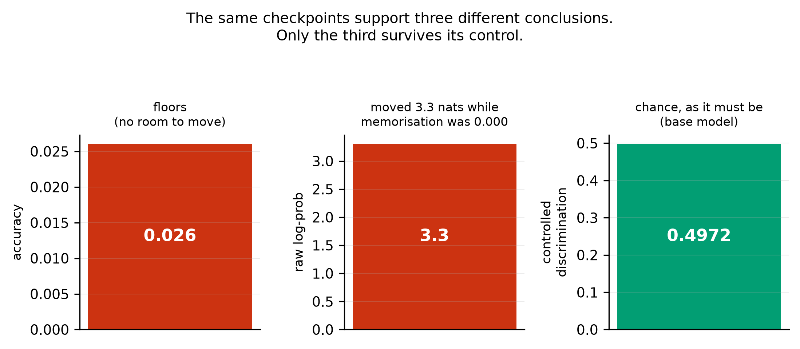
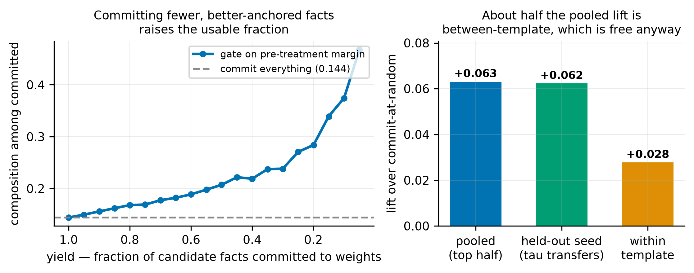

# Stored, Not Integrated: A Pre-Treatment Predictor and Three Controls for Knowledge Injection

**Preprint — Zenodo.** Version 1, 2026-08-08.

**Author:** Alex Liu
**License:** CC BY 4.0
**DOI:** to be assigned by Zenodo on publication
**Keywords:** continual learning · knowledge injection · fine-tuning · multi-hop composition · knowledge editing · evaluation methodology · negative results

**Cite as:** Alex Liu (2026). *Stored, Not Integrated: A Pre-Treatment Predictor and Three Controls for Knowledge Injection.* Zenodo. `<DOI>`

---

## Abstract

Fine-tuning stores new facts almost perfectly and leaves them unusable: in our setting injected-fact recall is 1.000 while two-hop composition using the same fact is 0.22. Recent work shows in controlled synthetic pretraining that composition requires prior compositional exposure. We ask a narrower question on a real pretrained model: **can we predict, before fine-tuning, which injected facts will become usable?** We can. A per-item measurement taken on the base model — how well it discriminates the other hop of the chain — predicts post-injection composition (Spearman ρ = +0.225, n = 1554, three seeds; positive within five of six templates). The dependence is *relational*: it survives controlling for how well the model knows the bridge entity itself, which alone predicts nothing (ρ = −0.023, p = 0.61).

We then decompose the failure and find that two of its four candidate causes are not where the problem is. Storage is solved (1.000). **Retrieval capability is not the bottleneck**: training the model to generate the bridge entity — from 0.000 to 1.000 — yields no gain over a control that trains an unrelated fact. Supplying the bridge in context does help (0.220 → 0.498), but a false-bridge control shows **≈73% of that gain does not depend on the bridge being correct**. A residual compositional cost survives all three interventions.

The predictor supports a policy, which we test: committing only the best-anchored half of candidate facts raises composition among committed facts from 0.144 to 0.207, and the threshold transfers across seeds (mean held-out lift +0.062). About half that lift is between-template and obtainable from template identity alone; the within-template component is +0.028.

Three of these results are controls rather than phenomena. Two experiments returned negative results: an intervention derived from the diagnosis did not beat a data-diversity control, and a test of template generalisation did not reach significance despite a design change intended to secure it. A published self-patching recovery figure is measured against a baseline of zero; on an uninjected model the per-item maximum of the same statistic is +0.80.

---

## 1 · Introduction

Deployed language models do not accumulate knowledge. The obvious diagnosis is that they cannot store new facts, and it is wrong. Fine-tuning stores facts well; what fails is *use*. On our data, a model asked plainly for an injected fact answers correctly 1.000 of the time, and the same model asked to use that fact as one step of a two-hop question answers correctly 0.22 of the time. When neither hop is pretrained, composition sits at chance and stays there through 34 epochs past memorisation saturation.

This gap is measured independently in at least three literatures that mostly do not cite one another (§2). What has been less clear is **what determines which side of the gap a given fact lands on** — and whether that can be known in advance.

**Our question is deliberately narrow.** Recent work establishes, in controlled synthetic pretraining, that composition requires prior compositional exposure: individuals seen in compositional contexts reach 0.83 two-hop accuracy while those absent stay at 0.01, with single-hop accuracy 0.97 for both [Karmim et al., 2026]. We do not claim that phenomenon. We ask whether, on a real pretrained model where exposure cannot be manipulated, the dependence is **graded** and **measurable in advance**.

### Contributions

1. **A pre-treatment, per-item predictor** of whether an injected fact will compose, computed with one forward pass on the base model before any training (§5.1). It is graded, not binary, and it survives an adversarial test that rules out the obvious confound (§5.2).
2. **A four-way decomposition** of the failure — storage, retrieval capability, in-context availability, residual — in which two components are shown *not* to be the bottleneck (§5.3).
3. **Three controls**, each of which changes the size of an effect obtained without it: a false-intermediate control for "supply the bridge" designs (§5.4), a null-controlled comparison for self-patching (§6), and a data-diversity control for knowledge-augmentation designs (§5.5).
4. **A policy test** (§5.8): the predictor supports a commit/defer gate whose threshold transfers across seeds. Pooled and within-template lifts are reported separately, since template identity is observable without the predictor.
5. **Two negative results** (§5.5, §5.6): an intervention derived from the diagnosis did not beat its control, and the template-generalisation test did not reach significance after the design change intended to secure it.

**Relation to prior work.** Each of the phenomena involved has prior art (§2): models following supplied-but-wrong intermediates, intermediates being no more retrievable in composing models, and composition depending on prior exposure. What is added here is the per-item pre-treatment predictor, and controls that quantify how much of two standard arguments survives.

---

## 2 · Related work

**Four literatures, one phenomenon.** Knowledge-editing reports ripple-effect failures where edits do not propagate to logically entailed consequences [Cohen et al., 2024]. Latent multi-hop reasoning reports chance-level composition of finetuned facts [Yang et al., 2025]. Continual knowledge injection reports knowing-using gaps of 81–92 percentage points — memorisation 99.8% against generalisation 7.8–18.2% [Dai et al., 2026]. Agent memory builds systems whose central failure mode is that stored knowledge goes unused, and is **disconnected from all three in both directions** — verified by a two-directional bibliography check.

*(An earlier version of this claim said all four literatures barely cite one another. A two-directional bibliography check showed three of them **do** cross-cite; only agent memory is disconnected. The narrowed claim is the one stated above.)*

**Prior exposure bounds composition.** [Karmim et al., 2026] manipulate compositional exposure during synthetic pretraining and find composition transfers only to entities seen in compositional contexts (0.83 vs 0.01). Their predictor is binary and manipulated during pretraining; the one used here is continuous and measured on a model we did not train.

**The intermediate is not more retrievable in composing models.** [Johnston & Belrose, 2025] probe for the bridge entity and find it "not more retrievable in models where we infer two-function composition than in models where we infer memorization", and "barely more retrievable than an arbitrary relation of the first entity". Our §5.3 reaches the same conclusion by intervention rather than probing: we *train* bridge generation to 1.000 and observe no compositional gain. Their paper notes that probes failed to detect differences which other measures did detect.

**Models follow supplied-but-wrong intermediates.** Well documented across unfaithful chain-of-thought [Turpin et al., 2023], adversarial multi-hop QA [Wu et al., 2024; Serbanescu et al., 2025], and context-vs-parametric knowledge conflict [Longpre et al., 2021]. We do not claim this as a finding. We use it as a **control**, and quantify what fraction of a claimed composition benefit it accounts for (§5.4).

**Shortcut detection in multi-hop settings** uses entity co-occurrence filtering and ablated prompts [Yang et al., 2025], or knowledge-neuron analysis with co-occurrence frequency [Ju et al., 2024]. These target E1→E3 direct association. The shortcut we control for is different: routing on a bridge token *supplied in the prompt*, regardless of its truth.

---

## 3 · Task construction

Chaining tasks are built by **graph traversal over PrimeKG/STaRK-Prime** (129,375 nodes, 8,100,498 edges, 10 node types, 18 edge types) rather than by LLM generation. A two-hop chain is a graph query, and generating one is a retrieval problem, not a creative one.

A task is a triple E1 —r1→ E2 —r2→ E3. We inject `fact2` (E2 —r2→ E3) and ask a chaining question whose answer is E3 and whose only route runs through E2. Constraints, all enforced at construction:

- **Pure addition** — no existing edge of the injected relation between E2 and E3
- **No shortcut** — no E1→E3 edge of any type
- **Unique bridge** — exactly one E2 satisfies the first hop
- **Name quality** — 4–40 characters, ≤10 tokens, no IUPAC strings

**Edge direction is type-directed, not stored-direction.** PrimeKG's stored edge orientation does not reliably match a template's semantic direction, and the mismatch differs per relation (`expression present` is stored gene→anatomy while the template needs anatomy→gene; `indication` is stored both ways). Using stored direction would have produced semantically reversed questions for a subset of relations, silently.

**Anchor recoverability is verified per item, on the base model, before injection.** For each item we score the first-hop question against four same-template distractors and record `anchor_margin` = logprob(correct) − max(logprob(distractor)). Items where the base model ranks the correct bridge above every distractor form the **anchored** arm; the rejected items form the **matched control** — same templates, same entity types, same one-fact injection, differing only in whether hop 1 is recoverable. Constructing the control from rejections rather than by separate sampling closes template-selection and fact-count confounds by construction.

**Injection.** LoRA (r=16, α=32, dropout 0.05) on all seven projection modules; AdamW, lr 2e-4, weight decay 0.01, batch 1 with gradient accumulation 8, 40 epochs, fp16. Qwen2.5-1.5B-Instruct unless stated. Only `fact2` is trained; the anchor is never trained (except in §5.5, where training it is the manipulation).

---

## 4 · Measurement

In this setting **the choice of measure decides the answer**.

**Two matchers, always both.** The source paper's [Dai et al., 2026] `substring_match` accepts `pred in gold`, so a prediction of `"a"` scores correct against gold `"Fazadinium bromide"`. We report both their matcher and a directional one (gold must appear in the prediction, with a length floor) and never rely on theirs alone.

**Accuracy floors, and log-probability is confounded.** Composition accuracy in the unanchored condition is 0.026 — too close to zero for a predicted decrease to register. Raw log-probability has range, but it is confounded by *format learning*: after one epoch it moved 3.3 nats while memorisation accuracy was still 0.000. A measure that moves before anything has been learned is measuring the answer template, not the answer.

**The distractor control resolves it.** Scoring the correct answer against same-type distractors under the same prompt absorbs the format gain, because format learning helps all candidates equally. On the base model, composition discrimination is **0.4972** — exactly chance, as it must be.

**Positive control.**

 On trained checkpoints, memorisation discrimination is **1.0000**. A low composition number is therefore a fact about the model, not a broken metric.

> **Figure 9** shows the same checkpoints supporting three different results — 0.026 accuracy, +3.3 nats log-probability, chance-level controlled discrimination — depending only on the measure. Every other number in this paper is reported with its control for this reason.

**Matched recall.** Every integration comparison is taken at a checkpoint where single-fact recall is equal across conditions; otherwise the comparison measures how much was learned rather than how well it integrated. For the arm experiment (§5.5) the matched point is end-of-training, where compute is identical by construction and recall spread across arms is 0.0000; using the "all facts memorised" checkpoint there would have given the treatment arms *more* training.

**Clustering.** Items share entities, templates and a model, so item-level intervals are anti-conservative. Group comparisons are additionally reported with a template-level cluster bootstrap, and §5.6 reports what that does to our own headline.

---

## 5 · Results

### 5.1 Composition is graded in a pre-treatment measurement

| | ρ | p |
|---|---:|---:|
| seed 0 | +0.2342 | 1.0 × 10⁻⁷ |
| seed 1 | +0.1686 | 1.3 × 10⁻⁴ |
| seed 2 | +0.2737 | 4.9 × 10⁻¹⁰ |
| **pooled (n = 1554)** | **+0.2254** | < 10⁻¹⁵ |

`anchor_margin` is measured on the base model *before* injection, so it cannot have been influenced by the treatment. **Within template, the correlation is positive in five of six** (mean +0.164), which answers the template-difficulty confound directly rather than by group matching.

The group contrast, for reference: anchored 0.2197 (range [0.2018, 0.2377]) vs matched control 0.0870 (range [0.0678, 0.0983]) across three seeds, ratio 2.53×, seed ranges non-overlapping. **This contrast is not statistically decisive at the template level (§5.6) and we do not rest the claim on it.**

**One template reverses.** `disease · indication` gives ρ = −0.107, confirmed across all three seeds. It is the one of six that fails. We have no supported account of why, and offer none.

### 5.2 The dependence is relational, not entity familiarity

`anchor_margin` confounds *knowing the link* E1→E2 with *knowing the entity* E2. We measured the second directly on the base model, with E1 absent from the prompt entirely.

| predictor of composition | ρ | p |
|---|---:|---:|
| anchor margin | **+0.2342** | 1.0 × 10⁻⁷ |
| entity familiarity | −0.0226 | 0.61 |
| margin, **controlling entity familiarity** | **+0.2513** | 1.1 × 10⁻⁸ |

The two share substantial variance (ρ = +0.53), so the test has teeth — and the shared part is not what drives composition. Controlling for familiarity leaves the margin effect **undiminished**; within template it is +0.2017, positive in three of four testable templates.

Entity familiarity has a small *negative* independent effect (−0.181 pooled, −0.178 within-template). We tested the obvious account — a well-known bridge has more competing associations — using PrimeKG degree as a model-independent proxy. Pooled it looked convergent (ρ = −0.184, p = 2.8 × 10⁻⁵, and near-zero correlation with familiarity, so apparently independent evidence). **It collapses within template** (mean −0.008): the pooled effect was a bridge-type contrast, since degree differs systematically between drugs, genes and diseases. We report the negative effect as an observation with no supported mechanism.

### 5.3 Retrieval capability is not the bottleneck

| failure mode | intervention | result |
|---|---|---|
| storage | ask for the injected fact plainly | **1.000** |
| retrieval capability | **train** bridge generation | 0.000 → **1.000**; no gain over control |
| in-context availability | **supply** the bridge as tokens | 0.220 → **0.498** (but see §5.4) |
| residual | bridge supplied *and* lookup available | 0.498 vs 1.000 for the same fact asked directly |

The second row is the substantive result. In every baseline run the model **cannot generate the anchor** (`fact1` accuracy 0.0000) while discriminating it above distractors — the discriminative/generative gap of §5.7, appearing inside the anchor itself. Training it to 1.000 is therefore a real manipulation of retrieval capability, and it produced no anchor-specific benefit (§5.5).

> **The dissociation:** the model can be made to produce the bridge perfectly and compose no better; but having the bridge present as tokens roughly doubles composition. What helps is externalising the intermediate, not being able to obtain it.

This agrees with [Johnston & Belrose, 2025]'s probing result and strengthens it: a probing null is weak evidence, a manipulation driven to ceiling is not.

### 5.4 A false-intermediate control: ≈73% of the "supply the bridge" gain is truth-insensitive

Supplying the intermediate is a standard way to argue that composition is bottlenecked on retrieval. We test what that argument is worth by supplying a **false** bridge — drawn from another item of the same template, whose own `fact2` was also injected, so the model has a stored answer for it.

| condition | → true answer | → false answer |
|---|---:|---:|
| chain | 0.2197 | 0.0135 |
| chain + **true** bridge | **0.4978** | 0.0090 |
| chain + **false** bridge | 0.1839 | **0.2018** |
| direct question about the false bridge | 0.0000 | **1.0000** |

The false bridge is followed 0.2018 of the time against a base rate of 0.0135 — a **15×** increase. The gain from the true bridge is +0.2781, so **≈73% of it is attributable to a mechanism indifferent to whether the bridge is correct.**

**Two routes, competing.** Not everything is lookup: the model declines the false bridge 80% of the time; under a true bridge its wrong-answer rate is 0.0090; and under a false bridge it still produces the *true* answer 0.1839 of the time against 0.2197 unaided — a contradicting bridge costs only −0.036. Truth-insensitive lookup (≈0.20) and the model's own path (≈0.18–0.22) agree and reinforce under a true bridge, and split under a false one.

> **What follows.** A `chain + intermediate` score is a mixture of composition and truth-insensitive lookup. Reported without this control it overstates composition by roughly threefold in this setup. The phenomenon is documented [Turpin et al., 2023; Wu et al., 2024; Serbanescu et al., 2025]; the fraction is specific to this setting.

### 5.5 A negative result: our own intervention failed

Our diagnosis suggested an intervention: during injection, also train the anchor link, converting the bridge from discriminatively known to generatively available. Four arms, each with **two training items per fact** so that token count, example count and schedule are matched (token spread across arms: 0.54%), differing only in the identity of the second item. Two seeds, 114 paired items.

| arm | second training item | composition |
|---|---|---:|
| A | `fact2` repeated | 0.2851 |
| **B** | the anchor link (treatment) | **0.3421** |
| C | a known fact about an **unrelated** entity | 0.3202 |
| D | a different known fact about **E2** | 0.3553 |

Pre-registered predictions and outcomes: B > A — **directional, not significant** (+0.057, McNemar p = 0.093). B > D — **refuted**, D is highest. B > C with C ≈ A — **refuted**, an unrelated fact helps as much. Gain largest for weak anchors — **reversed**, and the reversal appears in *every* arm, so it is not anchor-specific.

The manipulation itself was clean: anchor generation 0.000 → 1.000, recall spread across arms 0.0000, all arms learned their extra fact.

> **What we actually measured is a data-diversity effect.** Two distinct training examples beat one repeated example; what the second example is about does not matter. The spread among B, C and D (0.035) is no larger than seed noise (0.018–0.044).

**Scope.** At n = 114 the paired design detects ≈+0.07. An anchor-specific effect smaller than that is not excluded. The claim is *no detectable anchor-specific benefit*, not *no benefit*.

**Why arm A is the weaker baseline.** It repeats one example, so A vs {B, C, D} confounds the identity of the second fact with training-data diversity. The anchor-specific question is answered by B vs C vs D, and those are indistinguishable.

### 5.6 A second negative: template generalisation

Our matched-control contrast has non-overlapping seed ranges, but items cluster by template and a template-level bootstrap is the appropriate test. At five templates the confidence intervals overlapped. We rebuilt the dataset with seven templates specifically to fix this.

| | anchored | control | overlap |
|---|---|---|---|
| seed 0 | [0.0510, 0.3506] | [0.0206, 0.2008] | yes |
| seed 1 | [0.0773, 0.3100] | [0.0103, 0.2383] | yes |
| seed 2 | [0.0877, 0.3779] | [0.0034, 0.1678] | yes |
| pooled | [0.0724, 0.3481] | [0.0138, 0.2002] | yes |

**The fix did not work.** The design yields six usable clusters rather than seven, and going from five to six did not close the overlap. The effect size also fell — 3.69× at five templates to 2.53× at seven — indicating the earlier figure benefited from template selection.

We therefore do not claim the group contrast generalises across templates. The dose-response of §5.1 is measured *within* template and is unaffected by this.

### 5.7 Supporting results

**Discrimination far exceeds generation.** Base models answer relation questions at 0.83 discrimination and 0.03 generation across 16 relations × 60 items — a knowing-using gap one level below the main one, and the reason `anchor_margin` is a discriminative measure.

**The anchored arm separates from the control during memorisation, and the control never separates.** Anchored composition rises +0.117 between epoch 10 and memorisation saturation at epoch 22, while the control moves −0.011 over the same window and is flat thereafter.

*(An earlier version of this claim said composition* emerges after memorisation saturates. At three seeds on the seven-template data the post-saturation rise is **+0.022 with one seed negative** (−0.017, +0.050, +0.033), which does not support it. The earlier figure spanned the saturation point rather than isolating the interval after it. What the data support is the anchored/control divergence, not its timing relative to saturation.)

**A second scale.** At 0.5B the effect holds in the same direction.

**Gradient-magnitude masking cannot isolate.** Measured update-support overlap plateaus at ≈0.33; a 100× change in the masking fraction moves it 0.414 → 0.330. Even the top 0.1% of gradient entries overlap a third of the time. This rules out a natural design for testing isolation-vs-integration trade-offs, and implies that methods enforcing low overlap are working *against* the model's preferred update direction.

### 5.8 Does the predictor support a policy?

The predictor implies a gate: commit facts with `anchor_margin` ≥ τ to the weights, defer the rest. Testing it needs no new training — every item already has a pre-treatment margin and a post-injection outcome.

| yield (fraction committed) | τ | composition among committed | commit-at-random |
|---:|---:|---:|---:|
| 100% | −10.09 | 0.1441 | 0.1441 |
| 80% | −2.28 | 0.1681 | 0.1441 |
| **50%** | **−0.31** | **0.2072** | 0.1441 |
| 40% | +0.15 | 0.2190 | 0.1441 |
| 20% | +1.42 | 0.2839 | 0.1441 |

**The threshold transfers.** Choosing τ on one seed to hit 50% yield and applying it to the held-out seeds gives lifts of +0.064, +0.069 and +0.054 (mean **+0.062**) — so this is a policy, not hindsight fitting on the data being reported.

**But about half the lift is between-template.** Within template the mean lift is **+0.028**, positive in five of six. Template identity is observable without the predictor, so the within-template component is the part that requires it. Both are reported.

**Scope.** This triages the problem; it does not solve it. Even at 20% yield, composition among committed facts is 0.284 against recall of 1.000. The gate tells you which facts will be usable — it does not make more of them usable.

---

## 6 · A published self-patching figure is measured against the wrong baseline

Self-patching relocates a representation from one layer to another at entity-anchor positions and asks whether the answer improves; a reported recovery figure [Dai et al., 2026] takes the best layer pair from a grid of ~784, selected post hoc. **A maximum over many null comparisons is positive by construction.** We ran the identical sweep on an uninjected and an injected model — 60 items, 42-pair grid, same items, same selection procedure — so the selection bias is present on both sides and cancels.

| | base (null) | injected |
|---|---:|---:|
| mean Δ over all pairs | −0.00005 | −0.02146 |
| fraction of pairs improving | 0.449 | 0.414 |
| per-item **max**, mean | +0.1099 | +0.2335 |
| per-item **max**, p95 | **+0.8038** | +0.9167 |

**Patching typically hurts**: mean Δ is negative in both conditions and fewer than half of all pairs improve anything. And on a model with no injected knowledge to relocate, **a per-item maximum of +0.80 is what noise looks like.**

Our maximum is over 42 pairs against their ~784. A maximum over more candidates is larger, so **the null we measured is a lower bound on the selection bias in the published setup.**

**Does anything survive?** 13.3% of injected items exceed the base p95 (chance 5%), and AUC of injected-vs-base per-item maxima is 0.598 (chance 0.5). Something is there, but it is marginal — and a long way from what "recovers 58–75% of oracle headroom" implies. Reported against zero, the effect is dramatically overstated, because zero is the wrong baseline.

**A second observation about prior work.** The reported temporal lag between memorisation and composition does not appear when both hops are injected, across 34 post-saturation epochs. It appears only under anchoring — so it is a property of the anchored condition, not of injection.

---

## 7 · Limitations

**One domain.** All results use PrimeKG biomedical relations. The anchor effect could depend on how biomedical knowledge is represented. This was not tested.

**One model family, two scales.** Qwen2.5 at 0.5B and 1.5B. Two points do not establish a trend.

**The group contrast does not generalise across templates** (§5.6). The dose-response of §5.1 does not depend on it.

**The intervention arm is underpowered** for small effects (§5.5): ≈+0.07 detectable at n = 114.

**The patching result bounds a published claim; it does not localise our own effect.** 60 items, one seed, one injected checkpoint, coarse grid. The coarseness is conservative for the null argument and un-conservative for detecting a real effect.

**One template reverses the central correlation and we cannot explain it** (§5.1).

**We do not claim the phenomenon.** Composition depending on prior exposure is established in controlled synthetic pretraining [Karmim et al., 2026]; the intermediate not being more retrievable in composing models is established elsewhere [Johnston & Belrose, 2025]; models following false intermediates is established in three literatures. Our claims are the *graded, pre-treatment predictability* of the first, the *interventional* version of the second, and the *quantified control* for the third.

### Withdrawn claims

**Six** interpretations in this project were adopted and then withdrawn: a duration trade-off that lived entirely in an uncontrolled measure; a claim that a specific relation was non-composable; a claim that the mechanism was bridge-*entity* quality; the label "retrieval bottleneck" for §5.3's effect; the reading of `chain + bridge` as composition; and the claim that composition emerges *after* memorisation saturates.

Five were killed by a follow-up experiment. **The sixth was caught by drawing a figure whose caption its own data contradicted** — the post-saturation rise is +0.022 with one of three seeds negative, and the original evidence had spanned the saturation point instead of isolating the interval after it.

**Two of the six were inferences from a null result promoted to positive claims** — a reading that fits a null, adopted without a measurement that could distinguish it from alternatives. In both cases the subsequent test returned a different result.

---

## 8 · Conclusion

Whether an injected fact becomes usable is predictable before you inject it, from one forward pass on the base model, and the predictor tracks knowledge of the *relation* rather than familiarity with the entity. The failure is not storage and not retrieval capability. Supplying the intermediate helps, but most of that help is indifferent to whether the intermediate is correct — and a residual compositional cost survives even when storage is perfect, the bridge is handed over, and a lookup route is available.

Two experiments returned negative results: an intervention built on this diagnosis did not beat a control that trains an unrelated fact, and the design change intended to establish template generalisation did not do so.

**Acting on the predictor.** The predictor implies a gate: commit facts whose anchor margin clears a threshold, and defer the rest to retrieval rather than to weights (§5.8). Committing the best-anchored half raises composition among committed facts from 0.144 to 0.207 — **1.44×** — and the threshold **transfers**: chosen on one seed and applied to held-out seeds it yields a mean lift of +0.062. About half that lift is between-template and obtainable from template identity alone; the within-template component is +0.028, positive in five of six templates.

The gate selects which facts will be usable; it does not increase how many are. Composition among committed facts remains far below recall.

---

## Authorship and tooling

One human author, working with Claude (Anthropic) as an execution tool. The division of labour bears on how the interpretive claims should be read.

**The human author** set the research direction and the problem framing; chose which questions were worth asking and which lines to abandon; and set the methodological standards the work was held to — a strong baseline before any intervention, matched compute and matched recall on every comparison, designs audited *before* long runs rather than after, novelty checked before writing, and negative results documented rather than quietly dropped. They made the resource and scoping decisions, decided when to stop diagnosing and attempt an intervention, and are responsible for every claim made here.

**Claude** did the execution: literature search, all implementation (dataset construction from the knowledge graph, training, evaluation, analysis, figures), the statistics, and the drafting. Within that direction it also proposed specific experimental designs and interpretations — among them the four-arm token-matched comparison, the false-intermediate control, and the entity-quality test.

**Why the distinction matters here.** Claude proposed, and later withdrew, six interpretations (§7). Each was overturned by a test — five by a follow-up experiment, one by a figure that contradicted its own caption. The standards that forced those tests to be run at all came from the human author: insist on a control, audit the design before committing GPU time, check novelty before claiming it. **The claims that remain in this paper are the ones that survived that process, not the ones that were first proposed.** Two construction bugs were also caught by a pre-run audit rather than by the runs failing — an arm control that was 53.5% contaminated, and an evaluation subset that covered three of six templates — either of which would have produced clean-looking, wrong numbers.

A dated log of who did what, and when, is in `CONTRIBUTIONS.md`.

**Review status, stated accurately.** The human author reviewed the experimental design, the claims, and the interpretation throughout. **Independent line-by-line review of the five analysis scripts that produce the headline numbers** — `analyze_anchor_dose.py`, `analyze_arms.py`, `analyze_patching.py`, `test_false_bridge.py`, `analyze_policy.py` — **has not yet been completed.**

---

## Data and code availability

Deposited with this record:

- `src/` — dataset construction from PrimeKG/STaRK-Prime, training, evaluation, every reported analysis, and `make_figures.py`
- `data/tasks/` — the constructed chaining datasets, including the four token-matched arms and the matched control
- `results/` — per-item evaluation output for every reported run, and the JSON each figure is computed from

The knowledge graph itself (PrimeKG / STaRK-Prime) is not redistributed; construction scripts take it as input.

**Reproducing the figures:** `python src/make_figures.py` regenerates all eleven from the deposited result files without a GPU. No figure value is hand-entered; each panel recomputes from `results/*.json`.

Every number in the text traces to `docs/RESULTS.md` and thence to the run log in the run log.

---

## References

All entries were checked against the primary source (arXiv abstract page, ACL Anthology, or publisher record) on 2026-08-08. Nothing here was reconstructed from memory.

- Roi Cohen, Eden Biran, Ori Yoran, Amir Globerson, Mor Geva. *Evaluating the Ripple Effects of Knowledge Editing in Language Models.* Transactions of the ACL 12:283–298, 2024. [aclanthology.org/2024.tacl-1.16](https://aclanthology.org/2024.tacl-1.16/)
- Lu Dai, Ziyang Rao, Yili Wang, Hanqing Wang, Hao Liu, Hui Xiong. *Towards Mechanistically Understanding Why Memorized Knowledge Fails to Generalize in Large Language Model Finetuning.* arXiv:2607.08393, 2026.
- David Johnston, Nora Belrose. *Examining Two Hop Reasoning Through Information Content Scaling.* arXiv:2502.03490, 2025.
- Tianjie Ju, Yijin Chen, Xinwei Yuan, Zhuosheng Zhang, Wei Du, Yubin Zheng, Gongshen Liu. *Investigating Multi-Hop Factual Shortcuts in Knowledge Editing of Large Language Models.* ACL 2024 (Volume 1: Long Papers), pages 8987–9001. [aclanthology.org/2024.acl-long.486](https://aclanthology.org/2024.acl-long.486/)
- Yannis Karmim, Luis Marti, Djamé Seddah, Valentin Barrière. *Multi-Hop Knowledge Composition is Bound by Pretraining Exposure.* arXiv:2606.09338, 2026.
- Shayne Longpre, Kartik Perisetla, Anthony Chen, Nikhil Ramesh, Chris DuBois, Sameer Singh. *Entity-Based Knowledge Conflicts in Question Answering.* EMNLP 2021. arXiv:2109.05052.
- Julien Serbanescu, Mahdiyar Ali Akbar Alavi, Faezeh Ensan, Fattane Zarrinkalam. *FalseCoTQA: Adversarial Multi-Hop QA via Knowledge-Grounded False Chains of Thought.* SIGIR-AP 2025, pages 160–168. [doi.org/10.1145/3767695.3769494](https://doi.org/10.1145/3767695.3769494)
- Miles Turpin, Julian Michael, Ethan Perez, Samuel R. Bowman. *Language Models Don't Always Say What They Think: Unfaithful Explanations in Chain-of-Thought Prompting.* NeurIPS 2023. arXiv:2305.04388.
- Jian Wu, Linyi Yang, Zhen Wang, Manabu Okumura, Yue Zhang. *COFCA: A Step-Wise Counterfactual Multi-Hop QA Benchmark.* arXiv:2402.11924, 2024.
- Sohee Yang, Nora Kassner, Elena Gribovskaya, Sebastian Riedel, Mor Geva. *Do Large Language Models Perform Latent Multi-Hop Reasoning without Exploiting Shortcuts?* Findings of ACL 2025. arXiv:2411.16679.

---

## Figures

All generated by `src/make_figures.py` from `results/*.json`. Figures 1–9 are main text; A2–A3 are appendix.

| # | figure | supports |
|---|---|---|
| 1 | Composition: base / both-injected / anchored / matched control | §5.1 |
| 2 | Dose-response — composition by anchor-margin quintile, with within-template panels | §5.1 |
| 3 | Trajectory — the anchored arm separates from the control while memorising; the control never does | §5.7 |
| 4 | Four-way decomposition bar chart: storage / trained retrieval / supplied bridge / direct | §5.3 |
| 5 | False-bridge 2×2 — true vs false answer under true vs false bridge | §5.4 |
| 6 | Patch-delta null distribution vs injected, per-item maxima | §6 |
| 7 | Four arms with seed ranges, showing B ≈ C ≈ D | §5.5 |
| 8 | Gate yield/quality curve, with pooled vs held-out vs within-template lift | §5.8 |
| **9** | **Accuracy vs logprob vs controlled discrimination on identical checkpoints** (main text) | §4 |
| A2 | Anchor-margin distribution, anchored vs control split | §3 |
| A3 | Cluster-bootstrap intervals at 5 vs 6 templates | §5.6 |
